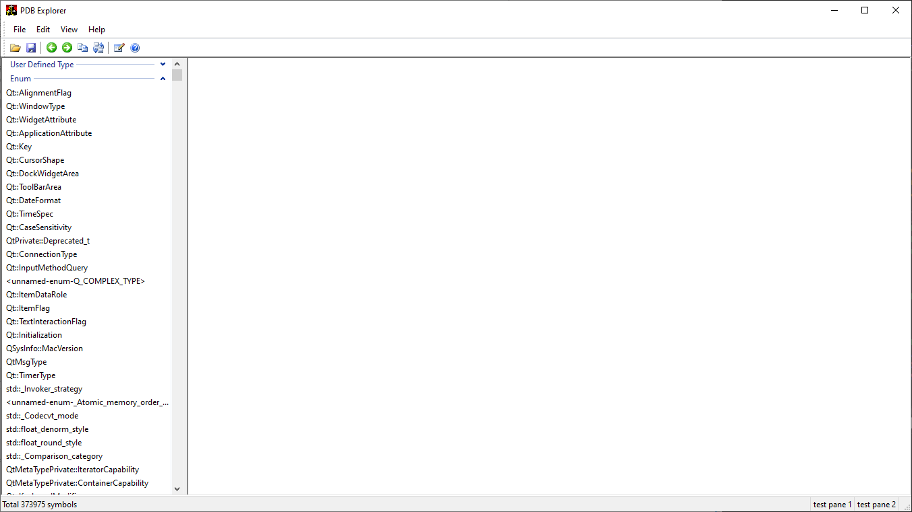

# pdb-explorer

View structures in PDB(Program Data Base) file

## Feature
- View UDT,ENUM,TYPEDEF 
- View large PDB files
- View while loading
- Keyword highlight
- Navigate between structures
- Fuzzy search

## Prerequisites
This tool use [DIA SDK](https://learn.microsoft.com/en-us/visualstudio/debugger/debug-interface-access/debug-interface-access-sdk?view=vs-2022) to get PDB info.So first need DIA SDK installed

The DIA SDK is installed by default when you install Visual Studio.It's in `C:\Program Files (x86)\Microsoft Visual Studio\2019\Community` by default.All you need is register relevant DLL.
```
%systemroot%\system32\regsrv32.exe "C:\Program Files (x86)\Microsoft Visual Studio\2019\Community\DIA SDK\bin\amd64\msdia140.dll"
```

## Build
Open `x64 Native Tools Command Prompt for VS 2022`,then run:
```
msbuild -m PdbExplorer.sln /p:Configuration=Release,Platform=x64,DebugSymbols=true,DebugType=pdbonly
or
msbuild -m PdbExplorer.sln /p:Configuration=Release,Platform=Win32,DebugSymbols=false,DebugType=none
```

## Screenshot



## References
- [viksoe.dk - PDB Explorer](https://www.viksoe.dk/code/pdbexplorer.htm)
- [PDBExp](https://github.com/titilima/PDBExp)
- [raw_pdb](https://github.com/MolecularMatters/raw_pdb)